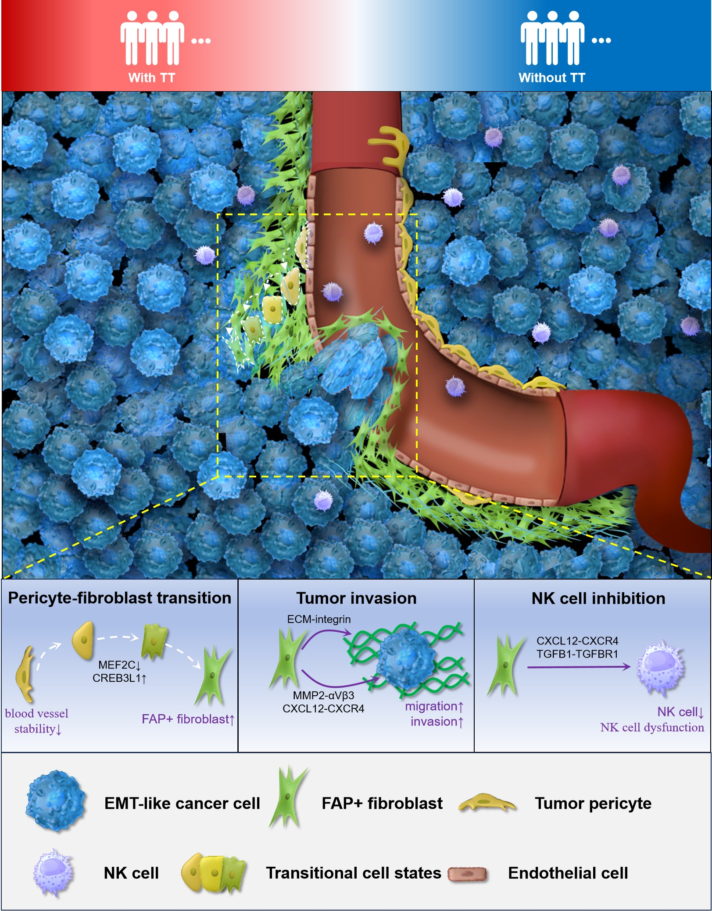

# Renal Cell  Carcinoma with Tumor Thrombus
Integrative Single-Cell and Spatial Multiomics Revealed that FAP+ Fibroblasts Orchestrate Tumor Microenvironment Remodeling in Renal Cell Carcinoma with Tumor Thrombus

